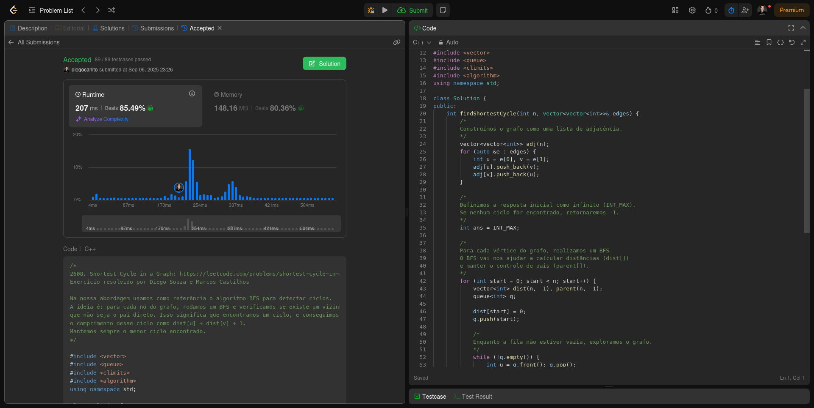
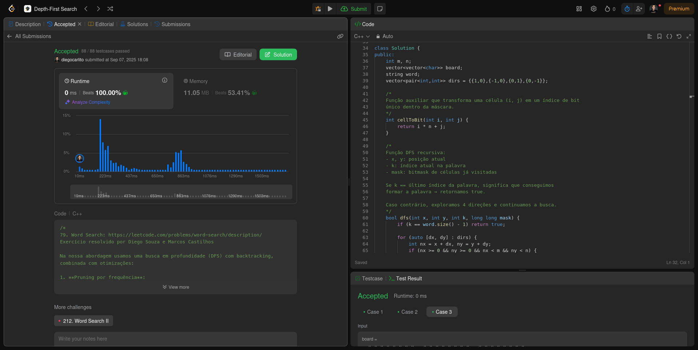
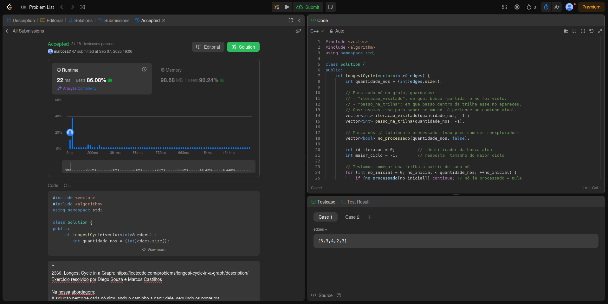
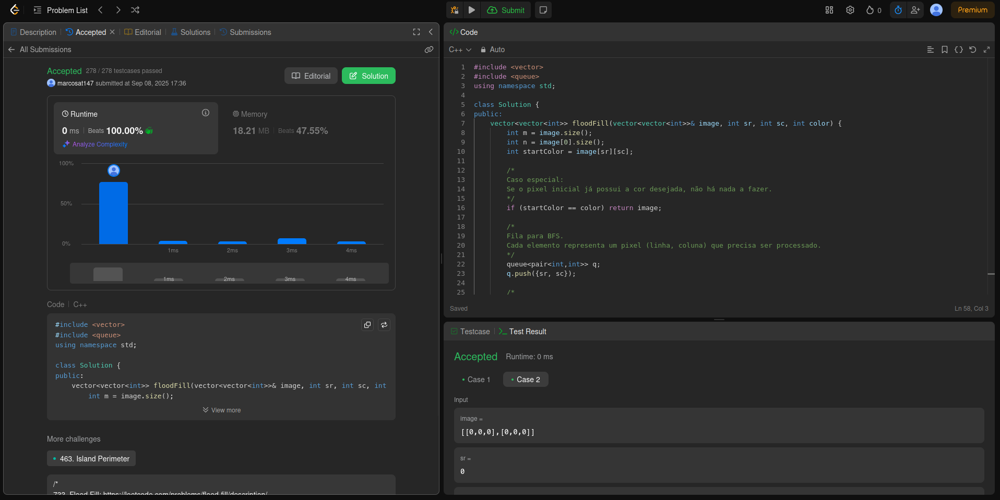

# Grafos1_LeetCode-D17

**Número da Lista**: 1 
**Conteúdo da Disciplina**: Grafos 1 

## Alunos
|Matrícula | Aluno |
| -- | -- |
| 22/1007690  |  Diego Carlito Rodrigues de Souza  |
| 22/1008300  |  Marcos Antonio Teles de Castilhos |

## Sobre 
O projeto possui como tema central a resolução de exercícios de programação competitiva com o tema de Grafos, utilizando a plataforma de juiz online LeetCode.

## Exercícios

| Exercício | Nível  | Vídeo Explicando |
|---------|--------|------------------|
| [2608. Shortest Cycle in a Graph](https://leetcode.com/problems/shortest-cycle-in-a-graph/description/) | Difícil | [Vídeo](https://youtu.be/K1PJ16TPQuo?feature=shared) |
| [2360. Longest Cycle in a Graph](https://leetcode.com/problems/longest-cycle-in-a-graph/) | Difícil | [Vídeo](https://youtu.be/K1PJ16TPQuo?feature=shared&t=257) |
| [79. Word Search](https://leetcode.com/problems/word-search/description/) | Médio | [Vídeo](https://youtu.be/K1PJ16TPQuo?feature=shared&t=112) |
| [733. Flood Fill](https://leetcode.com/problems/flood-fill/description/) | Fácil | [Vídeo](https://youtu.be/K1PJ16TPQuo?feature=shared&t=446) |

[Vídeo explicando todos os exercícios](https://youtu.be/K1PJ16TPQuo)

## Screenshots

### Exercício 01 - [2608. Shortest Cycle in a Graph](https://github.com/projeto-de-algoritmos-2025/Grafos1_LeetCode-D17/blob/master/2608_Shortest_Cycle_Graph/solution.cpp) - Difícil

  
   
  <a href="https://leetcode.com/problems/shortest-cycle-in-a-graph/submissions/1762051932">
    Visualizar submissão do exercício 2608
  </a>

### Exercício 02 - [79. Word Search](https://github.com/projeto-de-algoritmos-2025/Grafos1_LeetCode-D17/blob/master/79_Word_Search/solution.cpp) - Médio

  
   
  <a href="https://leetcode.com/problems/word-search/submissions/1763113468">
    Visualizar submissão do exercício 79
  </a>

### Exercício 03 - [2360. Longest Cycle in a Graph](https://github.com/projeto-de-algoritmos-2025/Grafos1_LeetCode-D17/blob/master/2360_Longest_Cycle_in_a_Graph/solution.cpp) - Difícil

  
   
  <a href="https://leetcode.com/problems/longest-cycle-in-a-graph/submissions/1763033682/">
    Visualizar submissão do exercício 2360
  </a>

### Exercício 04 - [733. Flood Fill](https://github.com/projeto-de-algoritmos-2025/Grafos1_LeetCode-D17/blob/master/733_Flood_Fill/solution.cpp) - Fácil

  
   
  <a href="https://leetcode.com/problems/flood-fill/submissions/1764098771/">
    Visualizar submissão do exercício 733
  </a>

## Instalação 
**Linguagem**: C++ 

## Verificação

Para validar se a solução implementada está correta, submeta o código no **[LeetCode](https://leetcode.com/)** e verifique se o exercício foi aceito. Cada solução contém o link para a descrição completa do problema no próprio código-fonte.

